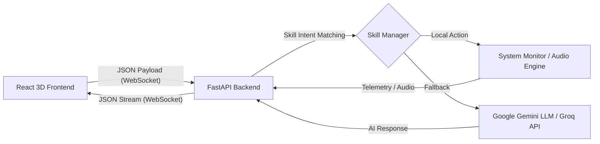

<div align="center">
  
  <h1>🌌 JARVIS NEXUS</h1>
  <p><strong>Next-Generation Cloud-Connected AI Assistant with 3D UI/UX</strong></p>
  <p>
    <a href="https://github.com/developer-gaurang/Jarvis_nexus"></a>
    <a href="#"></a>
    <a href="#"></a>
    <a href="#"></a>
  </p>
</div>

---

## 📖 Overview

**JARVIS Nexus** is an advanced, high-performance conversational AI assistant designed with a futuristic 3D graphical user interface. Combining cutting-edge WebGL rendering with a robust asynchronous backend, it delivers near real-time, context-aware interactions.

Whether you're executing complex commands, generating stunning imagery, or simply having an intelligent conversation, JARVIS Nexus orchestrates state-of-the-art Large Language Models (LLMs) via an elegant, low-latency WebSocket architecture.

## ✨ Key Features

- **🗣️ Multilingual Voice & NLP Processing:** Harnesses Google Gemini (2.5 Flash) and Groq APIs for instant language translation, intent recognition, and contextual responses.
- **⚡ Real-Time Bidirectional Streaming:** Powered by WebSockets to ensure zero-lag synchronous communication between the immersive frontend and the logic-heavy backend.
- **🎨 Cinematic 3D User Interface:** Integrated `@react-three/fiber` and `@react-three/drei` for fluid, dynamic core animations that react to audio amplitude and system states.
- **🌌 Intelligent Skill Manager:** A modular architecture allowing standalone dynamic "skills", such as Image Generation, System Monitoring, and Voice synthesis.
- **🎨 Glassmorphic & Cyberpunk UI:** Tailored with Tailwind CSS to present a dark, neon-accented, holographic dev-mask appearance.
- **🛡️ Secure Environment Sandboxing:** Strictly isolated secret-management using `.env` files preventing accidental credential leaks to public repositories.

---

## 🛠️ Tech Stack 

| Category | Technology | Badges |
| :--- | :--- | :--- |
| **Frontend Core** | React.js, Vite |   |
| **Styling** | Tailwind CSS | |
| **3D Rendering** | Three.js, R3F |  |
| **Backend Core** | FastAPI, Python 3.11 |   |
| **Communication** | WebSockets |  |
| **AI Integrations**| Gemini, Groq |  |

---

## 🏗️ Project Architecture



The system is decoupled into two primary microservices:
1. **Frontend (`/frontend`)**: A pure React + Vite SPA responsible for the 3D rendering loop, speech synthesis processing, and UI component management.
2. **Backend (`/backend`)**: A FastAPI ASGI server maintaining persistent WebSocket connections, orchestrating local logic (Skills), and proxying secure API requests to third-party LLM providers.

---

## 📸 Screenshots

> *(Replace the default screenshot below with the actual project UI)*


---

## 🚀 Installation & Setup

Want to deploy JARVIS locally? Follow this step-by-step guide.

### 1. Clone the Repository
```bash
git clone https://github.com/developer-gaurang/Jarvis_nexus.git
cd Jarvis_nexus
```

### 2. Backend Setup
1. Navigate to the backend directory:
   ```bash
   cd backend
   ```
2. Install Python dependencies:
   ```bash
   pip install -r requirements.txt
   ```
3. **Environment Variables (Crucial 🛡️):** Create a `.env` file in the `backend/` root safely protecting your API credentials.
   ```env
   # backend/.env
   GEMINI_API_KEY=your_google_gemini_api_key
   GROQ_API_KEY=your_groq_api_key
   NANO_BANANA_API_KEY=your_nano_banana_api_key
   ```
   > **Note:** `.env` is explicitly mentioned in `.gitignore` to prevent secret leaks across git commits. Never commit this file.

4. Run the Uvicorn server:
   ```bash
   python -m uvicorn main:app --host 0.0.0.0 --port 8000 --reload
   ```

### 3. Frontend Setup
1. Open a new terminal and navigate to the frontend directory:
   ```bash
   cd frontend
   ```
2. Install Node.js dependencies:
   ```bash
   npm install
   ```
3. Boot the Vite development server:
   ```bash
   npm run dev
   ```

### 4. Initialize
Open `http://localhost:5173` in your browser. The WebSocket connection will implicitly establish, and J.A.R.V.I.S will come online.

---

## 🔒 Security Best Practices

We prioritize credential security. Sensitive operations, such as calling Gemini or parsing external API routes, strictly happen server-side inside the standard FastAPI environment. **The frontend bundle has no environmental access to any AI API Keys.** 

Always ensure your API Keys stay within the protected `.env` context, and always verify that your `.gitignore` is properly configured!

---

<div align="center">
  <p><i>Building the Future of Human-Computer Interaction 🧠⚡</i></p>
  <b>Developed by <a href="https://github.com/developer-gaurang">Gaurang Verma</a></b>
</div>
